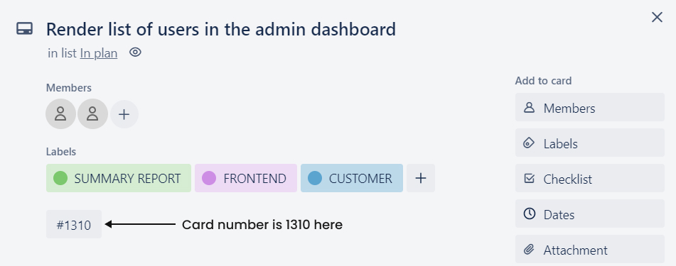
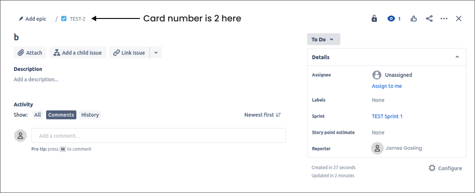
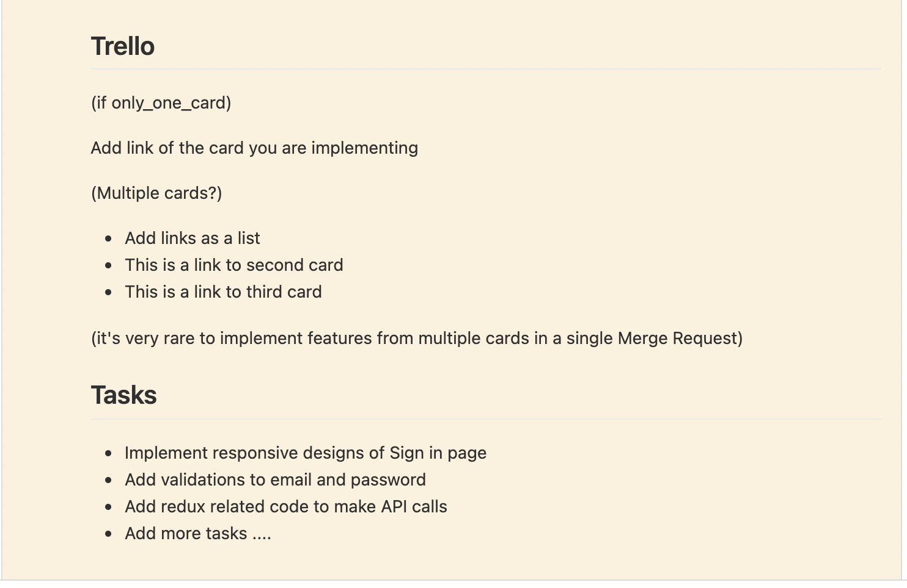
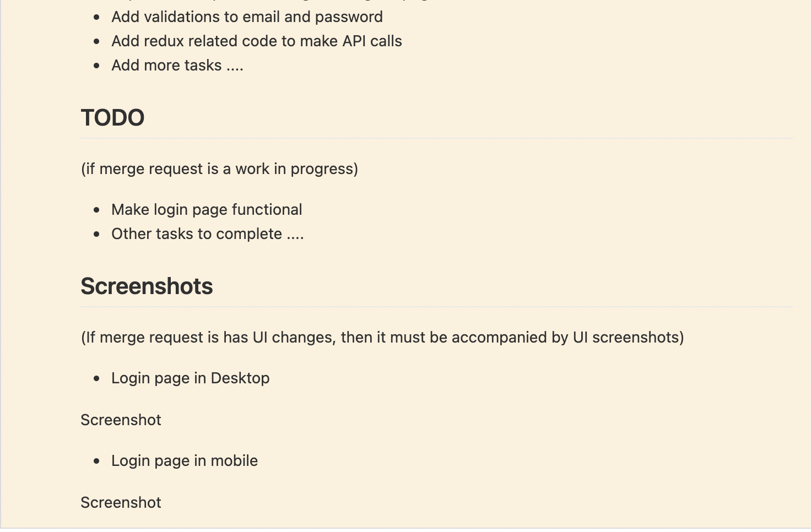

# GIT

## GIT Branching Rules

Many developers work on different features, fixes, hot fixes and upgrades in a single project. If each developer started to name the branch according to their preference, it will be difficult to know what they have worked on and will become confusing while merging the branch to deploy into production. Therefore, some standard must be followed while naming the branch. So, to avoid the confusion and smooth project completion, we follow certain naming standard for our branch name here at Truemark.

GIT branch name should follow following standard:

[COMMIT-TYPE](/docs/guidelines/git#commit-type) / [TICKET-NUMBER](/docs/guidelines/git#ticket-number) / [FEATURE-TITLE](/docs/guidelines/git#feature-title)

Now after you are familiar with our standard of naming the branch and example for it, let's discuss the standard in brief below:

#### COMMIT-TYPE

There can be different commit types according to what type of code you are adding to the project.

- If you are adding certain feature to the product, commit-type should be `features/`.
- If you are working on fixing the bugs that might come after QA tests your code after the release, commit-type should be `fixes/`.
- If you are working on fixing the bugs that are in production and require immediate fix, commit-type should be `hot-fixes/`.
- If you are working on upgrading the app whenever newer version of framework is released or certain package you have used are upgraded, commit-type should be `upgrades/`.

#### TICKET-NUMBER

There is chance where multiple developers are working on the same feature or bug in a large project. Therefore, to distinguish and break down there tasks, we tend to use Trello and Jira for project management here at Truemark. Each Jira or Trello card has a ticket number or card number assigned to them and we use this card number while naming our branch so that project manager or other managers get insights upon the task whenever it is completed.

We can find ticket number or card number inside Jira and Trello card assigned.

Example Trello Card with card number:



Example Jira Card with card number:



#### FEATURE TITLE

Feature title should be derived from the card you are working on. Sometimes it can be a bit long but generally it should be short yet clearly describe the feature/fixes that is being worked on.

If you are working on a feature to add UI for rendering the list of users, you can name your branch as:

```
features/1256/list-users
```

### Examples

Example for the git branch name:

#### Bad Branch naming

You should not use card title as it is as feature name.

```
// Bad
features/1310/as-a-user-i-should-see-list-of-users-in-my-dashboard
```

#### Good Branch naming

You should use short and descriptive name for your branch which defines the commit type and task you are doing.

```
// Good
features/1310/list-users-in-admin-dashboard
```

## Git Commit Rules

Git commit messages should be descriptive and should always describe the changes done while working on the certain task. Changes indicates all the updates, deletion and addition done in the repository.

It should follow the following standard while writing the commit message:

```
<COMMIT-TYPE>/<TICKET-NUMBER> - <FEATURE-TITLE>

Tasks done
---

- Short description of task 1 done
- Short description of task 2 done

// and so on...
```

Commit title generally follows the Trello title or branch name. After providing enough information of commit to the feature, we should provide list of tasks performed in the particular commit.

### Examples

Example for the git commit standard:

#### Bad Commit

Let's look at the bad commit example and see how confusing it will become to understand it.

```
// Bad git commit

git commit -m "Searching Functionality"
```

From above commit message, were you able to figure out what is going on there? It says `searching functionality` as commit title, but in which task the developer is working on and in which project? and what are we searching here? persons? birds? or cars? We are in a confusion about what this commit says. Also, there are no sub-tasks described which are done in order to complete the `Searching Functionality`. It doesn't answer some questions like, What are the tasks done in order to complete the `searching functionality`? What were the steps? In this scenario, when other developer works on maintaining it, they might get confused while trying to get insights on the work done for the `searching` feature. So, for making our project and codebase future proof, we should have our commit messages clean and clear.

#### Good Commit

Now let's analyze how good commit helps us and our fellow developers in long run.

```
// Good git commit

git commit -m "Features/129 - add input field for searching product

Tasks done
---

- add input field to search for products
- add empty value validation to search field
"
```

Now, let's analyze the scenario again. The commit title `Features/129 - add input field for searching product` clearly explains that the developer is working on adding feature for searching product on the application and more information about the task can be viewed by visiting `129` card number assigned in either Trello, Jira or other project management tools which has feature to provide numbers to the card. And while analyzing the sub-tasks, first one says `add input field to search for product` which do not even need explanation as it is clear that developer has added a search field to search for product. Similarly, `add empty value validation to search field` describes that there was validation added which triggers when empty value is provided in search field. So, this implies that git commit messages are always great for us as well as for other developers to know about the work we had done while implementing certain feature.

### What does good commit contains?

Good git commit is always clean and provides the context for the commit and changes made while doing the task. It does not contain any vague message and always follows a standard. Let's take a look at few points a good commit message will contain.

- Commit message should always be clean and explain the context on which it was written. It should clearly and concisely explain what is changed and why it is changed the way it has changed.

```
// Bad commit
git commit -m "add feature"

// Good commit
git commit -m "Features/1020 - add functionality to sort the product

Tasks done
---

- add and design select tag for selecting the sorting options for price and date added
- add functionality to sort products according to the price and date added
"
```

- Commit message should be standardize so that everyone who will be contributing will follow the same standard proposed by you or any organization.

```
// Standardized commit message used by Truemark developers

git commit -m "Features/1020 - add functionality to disable the add to cart button

Tasks done
---

- add and design add to card button for each product.
- add disabling functionality when no any product is available in the stock.
"
```

- Commit message should have a commit type so that it is clear to the reader on what context they are reading the commit for.

```
// Bad commit (without commit type)
git commit -m "fix issues"

// Good commit (with commit type 'Fixes')
git commit -m "Fixes/1678-fix issues in admin dashboard"
```

- Properly format your commit messages with title & body related with the task that you are working on.

```
// Bad commit -> (without title and body)
git commit -m "integrate paypal to the system"

// Good commit -> (with title and body)
git commit -m "Features/1700-integrate paypal into the system for payment of the product

Tasks done
---

- Add PayPal API for transactions done in the system
- Add functionality to pay through PayPal after purchasing product.
```

- Separate the title of the commit from body with blank line.

```
// Bad commit
git commit -m "Features/1767-generate movie ticket
Tasks done
---
- add and design button with the text 'Generate Movie Ticket'
- add functionality to generate the ticket in .pdf format.
"

// Good commit
git commit -m "Features/1767-generate movie ticket

Tasks done
---

- add and design button with the text 'Generate Movie Ticket'
- add functionality to generate the ticket in .pdf format.
"
```

- Make title short and descriptive. Don't copy & paste the user story from your project management tool.

```
// Bad commit
git commit -m "Features/110-as a user I want to download movie ticket after generating it so that I will be able to show the ticket in entrance"

// Good commit
git commit -m "Features/110-automatically-download-movie-ticket"
```

- Always use the commit body to explain about the tasks you have done and if there is unique context in the code, always leave a message so that your fellow developer will also get familiar with it.

```
// Bad commit
git commit -m "Features/1879-branding implementation"

// Good commit
git commit -m "Features/1879-custom branding implementation

Tasks done
---

- added functionality to provide custom branding options to the users
- added functionality to implement the custom branding upon change

Note: Branding is only implemented in dashboard as of now. The configuration is not implemented for other pages.
"
```

- Use imperative mood for the commit title rather than using declarative mood. Example - instead of writing the commit in declarative way like: I added the functionality to toggle between dark and night mode, you can write in imperative way like: Add functionality to toggle light and dark mode.

```
// Bad commit
git commit -m "Features/177-I added the functionality to toggle between dark and night mode"

// Good commit
git commit -m "Features/177-add functionality to toggle light and dark mode"
```

- If you are working in a team, always look to the prior commits made by your fellow developers for standards and guidelines.

- Always write the commit in direct manner without any filler words. You are writing to provide a context for changes done not an essay to win a prize.

```
// Bad commit
git commit -m "Features/890-add functionality to generate the form using JSON

Tasks done
---

- Basically created the JSON which contains all the information about the form to be generated
- Was unable to generate the JSON at first but did it after many tries and finally completed the functionality.

// Good commit
git commit -m "Features/890-functionality to generate form using JSON

- add JSON with all required form information
- add functionality to generate form using JSON schema.
```

### Different scenarios for commit message

We do not always make the commit when certain feature is completed but there are scenarios where we commit due to other reasons.

#### Scenario 1 - When PR comments are resolved

When we work on real world project, we work on certain feature to implement, then we send our branch for PR review where senior developer will review our code and provide comments over it if there are some issues in our code. Now, it is our responsibility to infer that this commit is done after resolving comments given in the PR. Now lets see an example for writing commit message after resolving the PR.

```
git commit -m "Features/132 Resolve PR comments

Tasks done
---

- Fixed grammatical typo inside the component <Alert />
- Fixed import structure for react packages inside component <Table />
"
```

#### Scenario 2 - When there is merge conflicts

Let's assume, you are working on certain feature to implement where you have worked on `ProductTable.js` file and another developer is working on another feature but has to do some changes in same `ProductTable.js` file. In this case, we can have merge conflicts as there is possibility that both of you have worked on the same line number. So, after resolving the conflict, you should push your changes to the same branch but we need to infer that there was merge conflicts and you have resolved it so that no any changes from both sides get lost. Now, lets see an example for writing commit message after resolving merge conflicts.

```
git commit -m "Features/569 Resolve merge conflict with develop branch

Merge Conflicts in
---

- src/components/Table.jsx
- src/views/User/List.jsx
"
```

## Merge Requests Guidelines

Everything you need to know about creating a merge request and everything that follows afterwards.

### Creating a merge request

When you are creating any new merge request, this is a template we prefer at Truemark because this gives the basic overview to the reviewer of what they are going to review in your merge request.

#### MD Format

```md
## Trello

(PR for only one card/ticket?)
Add link of the card you are implementing

(Multiple cards/tickets?)

- Add links to the card/ticket as a list
- This is a link to the second card/ticket
- This is a link to the third card/ticket

_NOTE_: It’s very rare to implement features from multiple cards in a single Merge Request

## Tasks

1. Implement responsive designs of Sign in page
2. Add validations to email and password
3. Add redux related code to make API calls
4. Keep adding tasks if more

## TODO

(if merge request is a work in progress, you need to add a list of what's left to implement)

1. Make login page functional
2. Keep adding tasks if more

## Screenshots

(If merge request has UI changes, then it must always be accompanied by screenshots of UI)

1. Login page in Desktop

Screenshot

2. Login page in mobile

Screenshot
```

#### Preview

This is what you will see when you click on the Preview button




### After creating a merge request

#### As a reviewee (you created the merge request)

As soon as you create a merge request, you should be doing the following things:

1. Review code changes in the merge request so that you can fix issues if you find any
2. Ask peer or supervisors to review your merge request
3. Keep an eye on your email when merge requests are reviewed and you are asked to update code
4. Answer questions in the reviewed code if any
5. Update code if required after the code has been reviewed

#### As a reviewer

1. Be nice and friendly
2. Don't comment on people's code, comment only on code! Purpose of code review is to have a friendly discussion than trying to show what you know and what you want the reviewee to do E.g. "Code could be better if proper formatting was added through prettier" to "You should add prettier, this code isn't looking good!"
3. Give proper coding examples wherever applicable.
