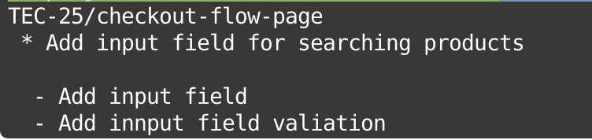

# GIT

### Git commit Rules

Git commit rules should follow following structure:

[PC] / [TRELLO CARD NUM-TASK TITLE]

- Task description

* Task 1 done
* Fix task 2

Here “TEC” is project code (Abbreviated for Truemark E-commerce), “25” is the card number (from jira or trello) for the current task and “checkout-flow-page” is task name in short.
As a whole “TEC-25/checkout-flow-page” becomes a branch name.
