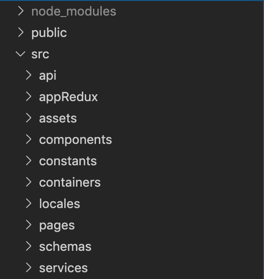
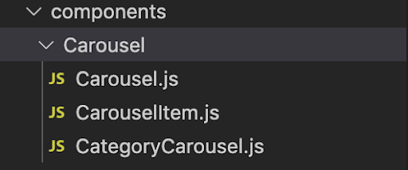
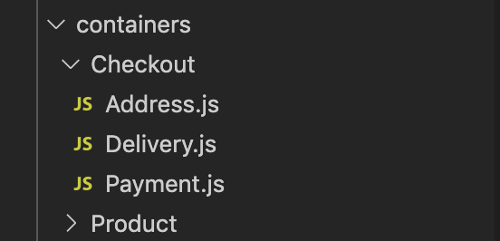
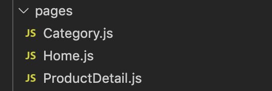
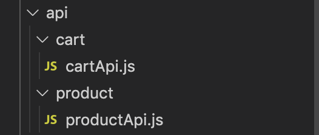
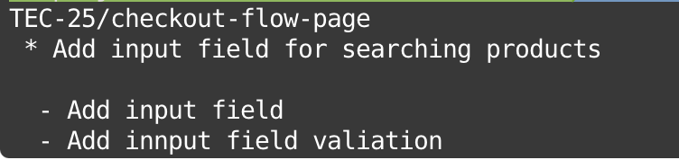

# ReactJS

## Standard Packages

Here, we plan to get insights into different packages used for ReactJS development and how to install those to our projects.

### Design

While working on any front-end project at Truemark, you will use bootstrap for design purposes. Bootstrap covers a wide range of CSS properties and helps from laying out the design to providing margin and padding to elements.

We can install bootstrap's library from npm or yarn to our projects. So, feel free to install using any medium.

Installing bootstrap using `npm`

```
npm install bootstrap
```

Installing bootstrap using `yarn`

```
yarn add bootstrap
```

Find the npm package and github link below:

NPM Package: [bootstrap npm package](https://www.npmjs.com/package/bootstrap)

GitHub Repository: [bootstrap github repo](https://github.com/twbs/bootstrap)

### Datepicker

Selecting a date in any frontend project with an existing "date" HTML tag can be easy to apply but hard to handle when it comes to localization in international projects. So, we use the "react-datepicker" package for all our date-related stuff at Truemark. It is a simple and reusable React component that can be used in setting the date format by localizing it with the country code needed.

This package can be added to any project using npm or yarn.

Installing react-datepicker using `npm`

```
npm install react-datepicker --save
```

Installing react-datepicker using `yarn`

```
yarn add react-datepicker
```

Find the npm package and github link below:

NPM Package: [react-datepicker npm package](https://www.npmjs.com/package/react-datepicker)

GitHub Repository: [react-datepicker github repo](https://github.com/Hacker0x01/react-datepicker)

You can also see demo for react-datepicker: [react-datepicker-demo](https://reactdatepicker.com/)

### Form Management

Managing forms with custom code and validity can easily become cumbersome for developers. Therefore, at Truemark, we use "react-final-form" which is easy to customize highly performant form management tool which supports different validations that are easy to incorporate into the project.

react-final-form can be added to any project using npm or yarn.

Installing react-final-form using `npm`

```
npm install --save final-form react-final-form
```

Installing react-final-form using `yarn`

```
yarn add final-form react-final-form
```

Find the npm package and github link below:

NPM Package: [react-final-form npm package](https://www.npmjs.com/package/react-final-form)

GitHub Repository: [react-final-form github repo](https://github.com/final-form/react-final-form)

### API Call

The majority of web applications developed are full stack applications so, it needs a reliable tool to handle all of the API calls in the frontend part. So, we use "Axios" for all the API calls here at Truemark. Axios is an HTTP client which handles all of the HTTP requests sent from the frontend. It has a lot of features that make any HTTP call easy to handle.

axios can be added to any project using npm or yarn.

Installing axios using `npm`

```
npm install axios
```

Installing axios using `yarn`

```
yarn add axios
```

Find the npm package and github link below:

NPM Package: [axios npm package](https://www.npmjs.com/package/axios)

GitHub Repository: [axios github repo](https://github.com/axios/axios)

### Drag and drop

While developing a web application with drag and drop feature, it is always a challenge for getting the output as expected. Drag and drop functionality has always been one of the complex functionalities to handle so, we use an extremely easy tool — "React DnD" for all of our draggable stuff in React app.

React DnD can be added to any project using npm or yarn.

Installing React DnD using `npm`

```
npm install react-dnd
```

Installing React DnD using `yarn`

```
yarn add react-dnd
```

Find the npm package and github link below:

NPM Package: [react-dnd npm package](https://www.npmjs.com/package/react-dnd)

GitHub Repository: [react-dnd github repo](https://github.com/react-dnd/react-dnd)

### CSS Preprocessor

We use SASS as our CSS preprocessor here at Truemark. Having more features and structure than the regular CSS, SASS tops our list so, we use SASS for all of our frontend projects at Truemark. You can also visit the SCSS guidelines provided in Truemark's guideline docs.

SASS can be added to any project using npm or yarn.

Installing SASS using `npm`

```
npm install sass
```

Installing SASS using `yarn`

```
yarn add sass
```

Find the npm package and github link below:

NPM Package: [SASS npm package](https://www.npmjs.com/package/sass)

GitHub Repository: [SASS github repo](https://github.com/sass/dart-sass)

### SVG Icons

Icons are a great way to convey the message in any frontend application and every frontend application's presentation and design are uplifted by the use of icons. Therefore, we use the "react-fontawesome" icon package for all of our icons at Truemark.

react-fontawesome can be added to any project using npm or yarn.

Installing react-fontawesome using `npm`

```
npm i @fortawesome/react-fontawesome
```

Installing react-fontawesome using `yarn`

```
yarn add @fortawesome/react-fontawesome
```

Find the npm package and github link below:

NPM Package: [react-fontawesome npm package](https://www.npmjs.com/package/@fortawesome/react-fontawesome)

GitHub Repository: [react-fontawesome github repo](https://github.com/FortAwesome/react-fontawesome)

## Folder Structure

1. Name of root folders should be in camelCase



2. Name of files and folders inside `src/components`, `src/containers`, `src/pages` should be in PascalCase.







3. Name of other files and folders (components, containers, pages excluded) should be in camelCase.




### Git commit Rules

Git commit rules should follow following structure:

[PC-NUM] / [TASK TITLE]

- Task description

* Task 1 done
* Fix task 2



Here “TEC” is project code (Abbreviated for Truemark E-commerce), “25” is the card number (from jira or trello) for the current task and “checkout-flow-page” is task name in short.
As a whole “TEC-25/checkout-flow-page” becomes a branch name.
