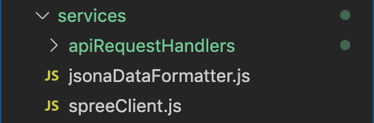

# ReactJS

## Standard Packages

Here, we plan to get insights into different packages used for ReactJS development and how to install those to our projects.

### Design

While working on any front-end project at Truemark, you will use bootstrap for design purposes. Bootstrap covers a wide range of CSS properties and helps from laying out the design to providing margin and padding to elements.

We can install bootstrap's library from npm or yarn to our projects. So, feel free to install using any medium.

Installing bootstrap using `npm`

```
npm install bootstrap
```

Installing bootstrap using `yarn`

```
yarn add bootstrap
```

Find the npm package and github link below:

NPM Package: [bootstrap npm package](https://www.npmjs.com/package/bootstrap)

GitHub Repository: [bootstrap github repo](https://github.com/twbs/bootstrap)

### Datepicker

Selecting a date in any frontend project with an existing "date" HTML tag can be easy to apply but hard to handle when it comes to localization in international projects. So, we use the "react-datepicker" package for all our date-related stuff at Truemark. It is a simple and reusable React component that can be used in setting the date format by localizing it with the country code needed.

This package can be added to any project using npm or yarn.

Installing react-datepicker using `npm`

```
npm install react-datepicker --save
```

Installing react-datepicker using `yarn`

```
yarn add react-datepicker
```

Find the npm package and github link below:

NPM Package: [react-datepicker npm package](https://www.npmjs.com/package/react-datepicker)

GitHub Repository: [react-datepicker github repo](https://github.com/Hacker0x01/react-datepicker)

You can also see demo for react-datepicker: [react-datepicker-demo](https://reactdatepicker.com/)

### Form Management

Managing forms with custom code and validity can easily become cumbersome for developers. Therefore, at Truemark, we use "react-final-form" which is easy to customize highly performant form management tool which supports different validations that are easy to incorporate into the project.

react-final-form can be added to any project using npm or yarn.

Installing react-final-form using `npm`

```
npm install --save final-form react-final-form
```

Installing react-final-form using `yarn`

```
yarn add final-form react-final-form
```

Find the npm package and github link below:

NPM Package: [react-final-form npm package](https://www.npmjs.com/package/react-final-form)

GitHub Repository: [react-final-form github repo](https://github.com/final-form/react-final-form)

### API Call

The majority of web applications developed are full stack applications so, it needs a reliable tool to handle all of the API calls in the frontend part. So, we use "Axios" for all the API calls here at Truemark. Axios is an HTTP client which handles all of the HTTP requests sent from the frontend. It has a lot of features that make any HTTP call easy to handle.

axios can be added to any project using npm or yarn.

Installing axios using `npm`

```
npm install axios
```

Installing axios using `yarn`

```
yarn add axios
```

Find the npm package and github link below:

NPM Package: [axios npm package](https://www.npmjs.com/package/axios)

GitHub Repository: [axios github repo](https://github.com/axios/axios)

### Drag and drop

While developing a web application with drag and drop feature, it is always a challenge for getting the output as expected. Drag and drop functionality has always been one of the complex functionalities to handle so, we use an extremely easy tool — "React DnD" for all of our draggable stuff in React app.

React DnD can be added to any project using npm or yarn.

Installing React DnD using `npm`

```
npm install react-dnd
```

Installing React DnD using `yarn`

```
yarn add react-dnd
```

Find the npm package and github link below:

NPM Package: [react-dnd npm package](https://www.npmjs.com/package/react-dnd)

GitHub Repository: [react-dnd github repo](https://github.com/react-dnd/react-dnd)

### CSS Preprocessor

We use SASS as our CSS preprocessor here at Truemark. Having more features and structure than the regular CSS, SASS tops our list so, we use SASS for all of our frontend projects at Truemark. You can also visit the SCSS guidelines provided in Truemark's guideline docs.

SASS can be added to any project using npm or yarn.

Installing SASS using `npm`

```
npm install sass
```

Installing SASS using `yarn`

```
yarn add sass
```

Find the npm package and github link below:

NPM Package: [SASS npm package](https://www.npmjs.com/package/sass)

GitHub Repository: [SASS github repo](https://github.com/sass/dart-sass)

### SVG Icons

Icons are a great way to convey the message in any frontend application and every frontend application's presentation and design are uplifted by the use of icons. Therefore, we use the "react-fontawesome" icon package for all of our icons at Truemark.

react-fontawesome can be added to any project using npm or yarn.

Installing react-fontawesome using `npm`

```
npm i @fortawesome/react-fontawesome
```

Installing react-fontawesome using `yarn`

```
yarn add @fortawesome/react-fontawesome
```

Find the npm package and github link below:

NPM Package: [react-fontawesome npm package](https://www.npmjs.com/package/@fortawesome/react-fontawesome)

GitHub Repository: [react-fontawesome github repo](https://github.com/FortAwesome/react-fontawesome)

### Skeleton UI

Real-world application is heavy and contains many more features that might take time to load. We can not expect our user's internet connection to be fast and can open the application in no time. But the reality is that many more and more people are using applications on mobile phones with slower internet connections. A slower internet connection can delay the loading of data and the user might be unable to figure out what is going on during data loading. Therefore, to make the user's experience better and make the user know that data is being loaded, we use a skeleton UI. Skeleton UI provides users with insights about the data which they will see after loading is complete.

Skeleton UI can be added to any project using npm or yarn.

Installing react-loading-skeleton using `npm`

```
npm i react-loading-skeleton
```

Installing react-fontawesome using `yarn`

```
yarn add react-loading-skeleton
```

Find the npm package and github link below:

NPM Package: [react-loading-skeleton npm package](https://www.npmjs.com/package/react-loading-skeleton)

GitHub Repository: [react-loading-skeleton github repo](https://github.com/dvtng/react-loading-skeleton)

### Form Select

We can not always provide the user with the luxury of inputting their own data neither we have the luxury to expect that the user is capable of knowing everything. Therefore, we always need to restrict our users by providing options to select from. But the simple form selection provided by HTML might not fulfill all the requirements we need in our project. There might be the situation to load data from the backend application into the select options, during which we might need loading behavior that might be very difficult to achieve by coding ourselves in the regular select tag. So, not only for styling the select tag but for other many features, we use react-select in all our projects.

React Select can be added to any project using npm or yarn.

Installing react-select using `npm`

```
npm i react-select
```

Installing react-select using `yarn`

```
yarn add react-select
```

Find the npm package and github link below:

NPM Package: [react-select npm package](https://www.npmjs.com/package/react-select)

GitHub Repository: [react-select github repo](https://github.com/JedWatson/react-select/tree/master)

### Linters

Developers tend to implement coding behavior that can be different from other developers. Every coder has a unique style of coding and approach. But while working in a team, if every developer in the team starts to use their coding behavior, it might be hard for fellow developers to get familiar with the coding style proposed which can cause misunderstanding that might lead to project failure. But we can not afford to fail in the project due to the lack of coding standards. So, here at Truemark, we use different linters to enforce the coding behavior and standards that every developer should follow. Linters are the tools that enforce coding standards and help in avoiding potential errors in the code. Different linters used at Truemark are discussed below.

#### ESLint

We can provide different coding patterns to the ESLint's configuration file and it will provide us with the error or warning if any rules mentioned in the configuration file are breached by the coder.

ESLint can be added to any project using npm or yarn.

Installing eslint using `npm`

```
npm i eslint
```

Installing eslint using `yarn`

```
yarn add eslint
```

Find the npm package and github link below:

NPM Package: [eslint npm package](https://www.npmjs.com/package/eslint)

GitHub Repository: [eslint github repo](https://github.com/eslint/eslint)

#### Prettier

We have enforced the coding pattern and behavior using ESLint, but what about the coding style and code formatting? So, for formatting the code and making it consistent over every file we code on, we use the Prettier code formatter.

Prettier can be added to any project using npm or yarn.

Installing prettier using `npm`

```
npm i prettier
```

Installing prettier using `yarn`

```
yarn add prettier
```

Find the npm package and github link below:

NPM Package: [prettier npm package](https://www.npmjs.com/package/prettier)

GitHub Repository: [prettier github repo](https://github.com/prettier/prettier)

#### Stylelint

There are no any frontend project without styling and CSS. In large industry level project, there is always a chance in having many style files and eventually it will be hard to manage the styles file manually. So, we need a tool which can manage our style files and helps us in avoiding potential errors. As ESLint only works with JavaScript or ECMAScript files, we need another tool for styles. Here is when Stylelint comes in action. Stylelint is a wonderful tool that can be used for enforcing convention and avoiding errors in our styles.

Stylelint can be added to any project using npm or yarn.

Installing stylelint using `npm`

```
npm i stylelint
```

Installing stylelint using `yarn`

```
yarn add stylelint
```

Find the npm package and github link below:

NPM Package: [stylelint npm package](https://www.npmjs.com/package/stylelint)

GitHub Repository: [stylelint github repo](https://github.com/stylelint/stylelint)

### Automated Review

As discussed above, working effectively and efficiently in a team can only be achieved by setting some standards while writing code, but reviewing if the standards are applied or not manually can be overwhelming for any developer out there. So, we need an automated tool to do this work for us. Automated review tools help us to maintain the standards while writing code which might further helps in avoiding fatal security threats and bugs in our source code. Basically, automated review tools go through our source code to find if standards are maintained while writing the code. Let's discuss about the automated review tools we use at Truemark.

#### Husky

What if we can apply all the standards mentioned for writing code while committing the code in git? Wouldn't it be better and hassle-free? Yes, it would be a lot less stressful and as a developer, we can write the code in our manner and structure as it will be formatted and checked while committing. There is a tool that can help us with it - Husky. Husky can be used with [Git Hooks](https://git-scm.com/book/en/v2/Customizing-Git-Git-Hooks) to maintain the script we write in various stages of git commands.

Husky can be added to any project using npm or yarn.

Installing husky using `npm`

```
npm i husky
```

Installing husky using `yarn`

```
yarn add husky
```

Find the npm package and github link below:

NPM Package: [husky npm package](https://www.npmjs.com/package/husky)

GitHub Repository: [husky github repo](https://github.com/typicode/husky)

#### Review Dog

Although husky is capable of maintaining all the standards in different git stages, it is always possible that some of the violations slip through it and make it to the code hosting providers via different Pull Requests(PR) created by developers. If there is a way to check for the standards even after the code is pushed, wouldn't it be better? For the same task, i.e. for checking the source code for potential violation of standards in code hosting sites, we use Review Dog. Review Dog does the work done by a husky in the local environment but in the cloud. It reviews the source code in the Pull Requests for violation of certain standards and reports it to the developer.

For using Review Dog in any project, you can go through their github repository and always learn more about it:

GitHub Repository: [review dog github repo](https://github.com/reviewdog/reviewdog)

### Routing

In modern web applications, there are many views that we need to display to users. Large applications contain many features and can need their own page to display those features. In other words, there are many views present in modern web applications and we need a way to identify those views uniquely. Therefore, for providing each page with its own identity, we require routes in the application. The route can provide any page in the application with its URL and helps users in identifying the page. So, here at Truemark, we use the react-router-dom package for handling all of the routings in the application.

React Router DOM can be added to any project using npm or yarn.

Installing react-router-dom using `npm`

```
npm i react-router-dom
```

Installing react-router-dom using `yarn`

```
yarn add react-router-dom
```

Find the npm package and github link below:

NPM Package: [react-router-dom npm package](https://www.npmjs.com/package/react-router-dom)

GitHub Repository: [react-router-dom github repo](https://github.com/remix-run/react-router)

### JS Utility Library

We use lodash as our go to JavaScript utility library as it makes working with arrays, objects, strings, numbers, etc. a lot easier. It is great while working with nested data whether it is in array or objects. Lodash also helps developer to write more clear and concise code while working with complex JS data structures where it is a lot harder to write bug free code.

Lodash can be added to any project using npm or yarn.

Installing lodash using `npm`

```
npm i lodash
```

Installing lodash using `yarn`

```
yarn add lodash
```

Find the npm package and github link below:

NPM Package: [lodash npm package](https://www.npmjs.com/package/lodash)

GitHub Repository: [lodash github repo](https://github.com/lodash/lodash)

### Enriched Editor

Whenever we need an editor for our web applications, we lean towards react-trix. React Trix is an enriched web text editor which contains all the required text elements to write the text for any purpose.

React Trix can be added to any project using npm or yarn.

Installing react-trix using `npm`

```
npm i react-trix
```

Installing react-trix using `yarn`

```
yarn add react-trix
```

Find the npm package and github link below:

NPM Package: [react-trix npm package](https://www.npmjs.com/package/react-trix)

GitHub Repository: [react-trix github repo](https://github.com/dstpierre/react-trix)

### Drag and drop file upload

There is always a case of adding files in the web applications, whether it is adding profile pictures or uploading files to the website. But we always tend to make a better user experience for users while dragging and dropping the files and it can be hard to customize the HTML's file input file. So, we use react-dropzone for all dragging and dropping file upload tasks. React dropzone provides us with additional functionalities like customizing the dropzone, displaying a preview for the uploaded file, and restricting file types and amounts while uploading.

React dropzone can be added to any project using npm or yarn.

Installing react-dropzone using `npm`

```
npm i react-dropzone
```

Installing react-dropzone using `yarn`

```
yarn add react-dropzone
```

Find the npm package and github link below:

NPM Package: [react-dropzone npm package](https://www.npmjs.com/package/react-dropzone)

GitHub Repository: [react-dropzone github repo](https://github.com/react-dropzone/react-dropzone)

## Folder Structure

1. Name of root folders should be in camelCase


2. Name of files and folders inside `src/components`, `src/containers`, `src/pages` should be in PascalCase.


3. Name of other files and folders (components, containers, pages excluded) should be in camelCase.




### Git commit Rules

Git commit rules should follow following structure:

[PC-NUM] / [TASK TITLE]

- Task description

* Task 1 done
* Fix task 2


Here “TEC” is project code (Abbreviated for Truemark E-commerce), “25” is the card number (from jira or trello) for the current task and “checkout-flow-page” is task name in short.
As a whole “TEC-25/checkout-flow-page” becomes a branch name.
